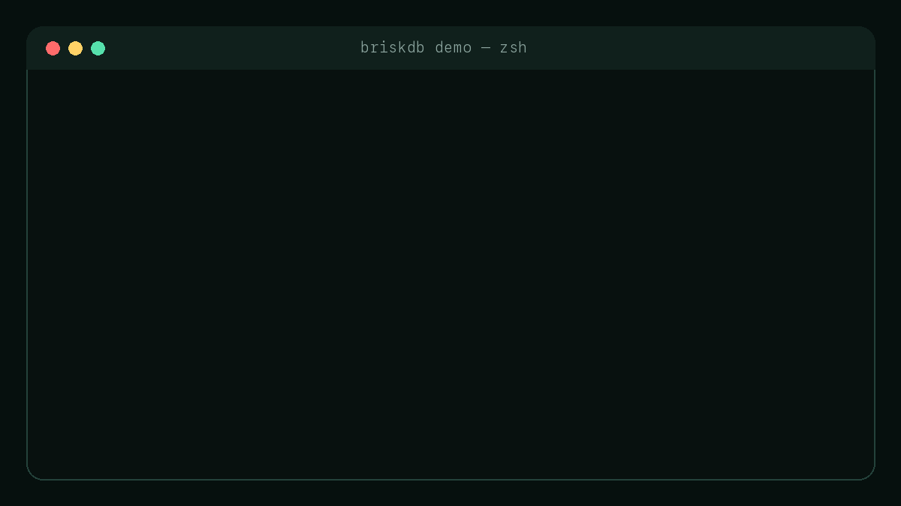
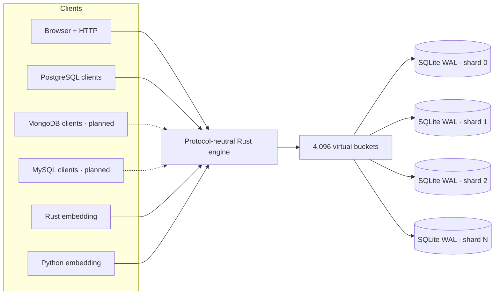

# BriskDB

[](https://github.com/schapman1974/briskdb/actions/workflows/ci.yml)
[](https://github.com/schapman1974/briskdb/actions/workflows/release.yml)
[](https://pypi.org/project/briskdb/)
[](LICENSE)

> **SQLite files. One sharded database.**

BriskDB turns ordinary SQLite files into one database with **parallel writes,
PostgreSQL compatibility, HTTP access, and embedded Rust/Python APIs**. It keeps
SQLite's proven storage engine and tooling; BriskDB adds the routing layer,
shard-safe IDs, cross-shard indexes, protocols, and operational guardrails.

<p align="center">
  
</p>

| The useful part | What it means |
| --- | --- |
| **Parallel SQLite writes** | Independent shard files have independent WAL writer locks. |
| **Use existing clients** | PostgreSQL and HTTP work today; MongoDB and MySQL are next. |
| **Embed or run a service** | The same Rust engine powers the binary, Python wheel, and Rust crate. |
| **Keep inspectable files** | Every data shard remains a normal SQLite database—no SQLite fork. |

[Try it without a compiler](#try-it-in-30-seconds) ·
[Download an alpha](https://github.com/schapman1974/briskdb/releases) ·
[Open the data browser](#browse-the-whole-logical-database) ·
[Follow MongoDB and MySQL](#follow-the-build)

> [!IMPORTANT]
> BriskDB is an alpha, not a production-ready database service. The
> [boundaries are explicit](#honest-alpha-boundaries), and measured results are
> published even when they are not flattering.

## Why developers might care

- **No SQLite fork.** Each shard is an ordinary SQLite WAL database that normal
  tools can inspect.
- **No central write lock.** Writes to different shards use different WALs and
  can progress in parallel.
- **No central ID write per row.** Native range and hi/lo allocation provide
  collision-free generated IDs across shards and processes.
- **Safe cross-shard pruning.** Global uniqueness is authoritative; asynchronous
  indexes use verification, watermarks, Bloom filters, and min/max summaries so
  an optimization cannot silently hide a row.
- **One engine everywhere.** PostgreSQL, HTTP, Rust, and Python share routing,
  limits, cancellation, errors, and storage behavior.
- **Operations are visible.** The separate loopback administration listener
  serves `/health`, `/metrics`, admin JSON, and the browser without exposing
  those handlers on the data listener.

## One engine, many ways in



The protocol adapters do not own database semantics. Routing, limits,
cancellation, values, sessions, and execution live in the shared Rust engine,
leaving room for more protocols and storage adapters later.

## Browse the whole logical database


BriskDB serves a responsive, read-only data browser at `/admin` on its separate
administration listener. It uses the same bounded engine paths as other
clients, combines sharded rows into one logical view, reads global tables once,
and preserves large integer values.

For the current local alpha:

```text
http://127.0.0.1:7655/admin
username: admin
password: admin
```

The temporary credentials are a development convenience—not a security
boundary—which is why both HTTP listeners currently require loopback addresses.

## The unusual part: shard-safe generated IDs

BriskDB has two generated-ID designs for sharded tables:

- **`native_range_v1`** gives every shard a non-overlapping positive 64-bit
  range. SQLite's own `INTEGER PRIMARY KEY AUTOINCREMENT` performs the actual
  allocation locally, with no central write for each inserted row.
- **`hilo_v1`** durably leases blocks of 4,096 IDs from the manifest, then
  allocates in memory and hash-routes each ID. Crashes may leave gaps, but an ID
  is never reused.

Both policies are versioned in the manifest. Generated-key execution is still
experimental and opt-in; the exact contract lives in
[Generated keys](docs/GENERATED_KEYS.md).

## What works now

| Capability | Alpha status |
| --- | --- |
| Durable virtual-bucket routing over independent SQLite WAL files | Working |
| Exact-key routing and bounded scatter/gather reads | Working |
| HTTP query/write API, operational API, and admin data browser | Working on separate loopback-only data/admin listeners; request correlation, bounded NDJSON rows, request-local result limits, eligible-write durable replay, readiness, inspection, cancellation, stopped-copy capability, and passive checkpoint are versioned |
| PostgreSQL wire protocol | TLS/SCRAM, backpressured row streaming, SQLite-interrupt cancellation, text/binary CRUD, real single-shard transactions, and a live psql/tokio-postgres/psycopg/SQLAlchemy matrix |
| Offline import from a standard SQLite database | Working |
| Native-range and hi/lo generated IDs | Experimental, opt-in |
| Cross-shard indexes and global value leases | Experimental/opt-in: correctness, recovery, and shard pruning pass; current latency/write overhead is documented in the release gate |
| Global-index health and Prometheus metrics | Admin listener `/health`, `/v1/admin/global-indexes`, `/metrics`, plus Rust operational reports |
| Ubuntu/macOS x86-64 and ARM64 release artifacts | Published |
| Debian package and hardened systemd service | Published |
| Rust library entrypoint with optional attached listeners | Working; the opt-in `documents` feature adds a thin native document-command facade |
| Same-host service and embedded processes sharing one ready root | Working on local filesystems |
| Native MongoDB wire protocol with TinyMongo parity | [Versioned parity contract](docs/MONGO_PARITY.md), [Rust BSON foundation](docs/BSON.md), [document storage/import](docs/DOCUMENT_STORAGE.md), the first [protocol-neutral document commands](docs/DOCUMENT_ENGINE.md), and their embedded Rust facade landed; remaining matcher/write semantics and the listener remain [planned](https://github.com/schapman1974/briskdb/issues/160) |
| MySQL wire protocol | [Planned](https://github.com/schapman1974/briskdb/issues/40) |
| Native Python extension | Typed sync/async SQL and opt-in BSON document commands; tagged releases build audited macOS/Linux ARM/x86 wheels |
| Serverless lifecycle | [Planned](https://github.com/schapman1974/briskdb/issues/194) |

## Where BriskDB fits

These projects solve different problems. This table is a compass, not a
benchmark scoreboard.

| Project | Built for | Write model | Access | Storage shape |
| --- | --- | --- | --- | --- |
| **BriskDB** | Same-host sharding, service + embedding | Parallel across independent shard WALs | PostgreSQL, HTTP, Rust, Python | Manifest + ordinary SQLite shard files |
| [SQLite](https://sqlite.org/wal.html) | Small, embedded, single-file databases | One writer per WAL file | SQLite API and ecosystem | One ordinary SQLite file |
| [rqlite](https://rqlite.io/docs/features/) | Simple multi-node availability | Writes flow through a Raft log; optimized for HA, not write scaling | HTTP + client libraries | Replicated SQLite state across nodes |
| [Turso / libSQL](https://docs.turso.tech/sdk/introduction) | Cloud/edge access and local-first sync | Product-dependent primary or local push/pull model | SDKs + HTTP | Turso Database or legacy SQLite-compatible libSQL |
| [Citus](https://www.postgresql.org/about/news/citus-120-released-2687/) | Mature distributed PostgreSQL | Parallel across PostgreSQL worker shards | PostgreSQL | PostgreSQL coordinator + worker cluster |

Choose BriskDB when you want one local service or embedded engine to spread
write contention across inspectable SQLite files while speaking familiar
database protocols. Choose the others when a single SQLite file, replicated
high availability, managed edge sync, or a mature multi-node PostgreSQL cluster
is the real requirement.

## Try it in 30 seconds

Install the published native wheel—no clone and no Rust compiler:

```bash
python -m pip install --only-binary=:all: briskdb
curl -fsSLO https://raw.githubusercontent.com/schapman1974/briskdb/main/examples/launch_demo.py
python launch_demo.py
```

The demo makes 32 routed writes from four Python threads, proves that all four
ordinary SQLite shard files received rows, reads every row back, checks HTTP
health, and starts the PostgreSQL listener. It uses a temporary directory and
cleans up after itself. The GIF renderer executes this exact scenario, and CI
tests it against every published wheel target.

To run the standalone service, download the matching macOS/Linux ARM64 or
x86-64 archive from the [latest GitHub release](https://github.com/schapman1974/briskdb/releases),
then:

```bash
./briskdb --data-dir ./briskdb-data --shards 4
```

Open the [data browser](http://127.0.0.1:7655/admin) or inspect the service on
the separate administration listener:

```bash
curl http://127.0.0.1:7655/health
curl http://127.0.0.1:7655/v1/ready
curl http://127.0.0.1:7655/v1/admin/catalog
curl http://127.0.0.1:7655/metrics
```

Enable the PostgreSQL listener explicitly. Simple and parameterized
text/binary prepared queries share the same bounded engine path:

```bash
./briskdb --data-dir ./briskdb-data --postgres-listen 127.0.0.1:5433
psql -h 127.0.0.1 -p 5433 -d default
```

That local development form is unauthenticated and therefore loopback-only.
The [PostgreSQL quickstart](docs/POSTGRES_QUICKSTART.md) shows the four settings
for TLS plus SCRAM-SHA-256; secure mode is required for any remote bind.

Registered tables can also be queried over HTTP:

```bash
curl -X POST http://127.0.0.1:7654/v1/query \
  -H 'content-type: application/json' \
  -d '{"sql":"SELECT id, name FROM widgets WHERE id = ?1","params":["widget-1"]}'
```

The [versioned HTTP contract](docs/HTTP_API.md) defines requests, response
shapes, value encodings, request IDs, eligible-write idempotency, bounded row
streaming, limits, and errors. `GET /v1` reports the supported API version and
configured result ceilings.
The [HTTP listener contract](docs/HTTP_LISTENERS.md) defines the strict route
split, configuration, and shared startup/shutdown behavior. The data listener
defaults to `127.0.0.1:7654`; administration defaults to
`127.0.0.1:7655` and can be disabled with `--admin-listen disabled`.

Have an existing SQLite database? Use the offline
[SQLite importer](docs/SQLITE_IMPORT.md). Linux releases also include `.deb`
packages with a hardened systemd service.

Embedding in Rust starts with `BriskDb::open()` or the validated builder. The
[embedded Rust guide](docs/EMBEDDED_RUST.md) includes a complete listener-free
example. Choose a shard count when creating data; later opens detect it from
the manifest and reject explicit mismatches. Use `default-features = false`
with the `embedded` feature for SQL-only embedding. Select `documents` and
explicitly enable `DocumentSupport` to submit native BSON commands through
`BriskDb` or an owned `BriskSession`. Both forms use the same document engine
and routing plans as future protocol adapters; see the
[crate feature map](docs/CRATE_FEATURES.md).

Python runs the same engine directly in-process. It starts no listener by
default, but `Database.serve()` can attach data HTTP, administration HTTP, and
PostgreSQL listeners (remote PostgreSQL requires its TLS/SCRAM arguments):

```python
with briskdb.open("./data", shards=4) as db:
    with db.serve(postgres="127.0.0.1:0") as server:
        print(server.data_address, server.admin_address, server.postgres_address)
```

The wheel also exposes the current protocol-neutral document slice through
sync and asyncio sessions. Install PyMongo for its BSON value classes, then
enable document commands on the database handle:

```bash
python -m pip install briskdb pymongo
```

```python
from bson import ObjectId
import briskdb

with briskdb.open("./data", shards=4, documents=True) as db:
    with db.session() as session:
        session.create_collection("app", "notes")
        note_id = ObjectId()
        session.insert_one("app", "notes", {"_id": note_id, "body": "hello"})
        print(session.find("app", "notes", {"_id": note_id})["documents"])
```

PyMongo remains optional and is loaded only when a document method runs, so a
SQL-only installation has no BSON dependency. The current slice supports
collection/index metadata, one explicit-ID insert, empty or exact-`_id`
find/count, and exact-`_id` deletion. Secondary index declarations remain
`pending_build`.

See the [Python quickstart](python/README.md) for sync and asyncio write/read
examples and the [Python value contract](python/VALUE_CONVERSIONS.md) for BSON,
datetime, UUID, and error behavior. Tagged releases publish compiler-free
`cp39-abi3` wheels for the
[supported platform matrix](python/COMPATIBILITY.md); repository checkouts can
still be installed from source with Rust 1.85+. Independently spawned Python,
Rust, and server processes can share a ready local data directory; read the
[multi-process contract](docs/MULTIPROCESS.md) before deploying that pattern.

## Still just inspectable files

```text
briskdb-data/
├── .briskdb-process.lock
├── .briskdb-startup.lock
├── manifest.sqlite
├── global-indexes/
│   └── global.sqlite
└── shards/
    ├── 0000.sqlite
    ├── 0001.sqlite
    ├── 0002.sqlite
    └── 0003.sqlite
```

The manifest versions routing, catalogs, migrations, generated-ID ownership,
and integrity metadata. Application rows stay in ordinary SQLite files.

## Where this is going

- **MongoDB:** complete the matcher, write, index, cursor, and aggregation
  semantics behind the native embedded command facade, then add a Rust Mongo
  listener and differential TinyMongo parity.
- **More wire protocols:** broader PostgreSQL client compatibility and a MySQL
  listener, all sharing the same engine behavior.
- **Serverless storage:** atomic snapshots, object-store adapters, and fenced
  single-writer operation beyond today's embedded warm-handler pattern.
- **Future storage adapters:** SQLite is the first backend, while the engine
  boundaries are being kept reusable for other durable backends.

Follow the [roadmap](ROADMAP.md) or browse the
[open issues](https://github.com/schapman1974/briskdb/issues).

## Follow the build

Star BriskDB if you want to follow any of these bets:

- a native MongoDB wire protocol with large-app TinyMongo parity;
- MySQL compatibility over the same protocol-neutral Rust engine;
- serverless snapshots and object-store-backed lifecycle;
- more storage backends without giving up the ordinary SQLite option; or
- honest benchmark and failure evidence as the alpha becomes a real release.

If you try it, an issue with your client, workload, or missing SQL shape is even
more valuable than a star. Start with the
[alpha releases](https://github.com/schapman1974/briskdb/releases), then tell us
[what broke or what surprised you](https://github.com/schapman1974/briskdb/issues/new/choose).

## Honest alpha boundaries

- PostgreSQL has TLS and single-identity SCRAM-SHA-256 authentication, but no
  roles or authorization yet. The separated HTTP data and administration
  listeners remain loopback-only development surfaces.
- No general atomic transaction across multiple shard files.
- Global ordering/pagination and general aggregate pushdown are still limited.
- HTTP offers bounded row streaming but no retained cursor, continuation token,
  cross-shard snapshot, or new global `ORDER BY`/`OFFSET`/`LIMIT` semantics.
- The supported backup today is a stopped-server copy of the complete data
  directory after every server and embedder exits. Passive checkpoints now
  report shards, manifest, and global-index storage through both Rust and the
  administration API, but are not an online snapshot. The backup capability
  endpoint reports this limitation rather than copying live files;
  online/serverless snapshots are planned.
- Multi-process access is same-host/local-filesystem only. Schema, catalog,
  upgrade, and recovery work requires sole-process ownership.
- Pre-1.0 storage and public-library compatibility can change between releases.
- Python document commands currently require explicit `_id` values and only
  implement empty or exact-`_id` filters. Updates, aggregation, bulk writes,
  retained document cursors, and built secondary indexes are still planned.
- Ubuntu 24.04 x86-64 receives the full required Rust CI suite. Python wheels
  receive native build, audit, install, restart, corruption, and concurrency
  checks on Linux/macOS x86-64 and ARM64.
- Global-index operational metrics are available, but BriskDB still lacks the
  broader production suite for traces, slow-query logs, resource saturation,
  alert rules, and long-running capacity validation.

## Go deeper

- [Architecture](docs/ARCHITECTURE.md)
- [HTTP listener separation](docs/HTTP_LISTENERS.md)
- [Global uniqueness and value authority](docs/GLOBAL_INDEX_AUTHORITY.md)
- [Global-index production gate](docs/GLOBAL_INDEX_RELEASE_GATE.md)
- [Embedded Rust](docs/EMBEDDED_RUST.md)
- [Embedded SQL](docs/EMBEDDED_SQL.md)
- [Crate features and support tiers](docs/CRATE_FEATURES.md)
- [PostgreSQL quickstart](docs/POSTGRES_QUICKSTART.md)
- [Tested PostgreSQL clients](docs/POSTGRES_CLIENTS.md)
- [Mongo compatibility parity contract](docs/MONGO_PARITY.md)
- [BSON value and codec contract](docs/BSON.md)
- [Document catalog, storage, and TinyMongo import](docs/DOCUMENT_STORAGE.md)
- [Protocol-neutral document engine](docs/DOCUMENT_ENGINE.md)
- [SQL compatibility](docs/SQL_COMPATIBILITY.md)
- [Generated keys](docs/GENERATED_KEYS.md)
- [Storage format](docs/STORAGE_FORMAT.md)
- [Sharing one data directory between processes](docs/MULTIPROCESS.md)
- [Debian and systemd installation](docs/DEBIAN_INSTALL.md)
- [Pre-1.0 compatibility policy](docs/PRE_1_COMPATIBILITY.md)
- [Contributing](CONTRIBUTING.md)

BriskDB is available under the [MIT License](LICENSE).
