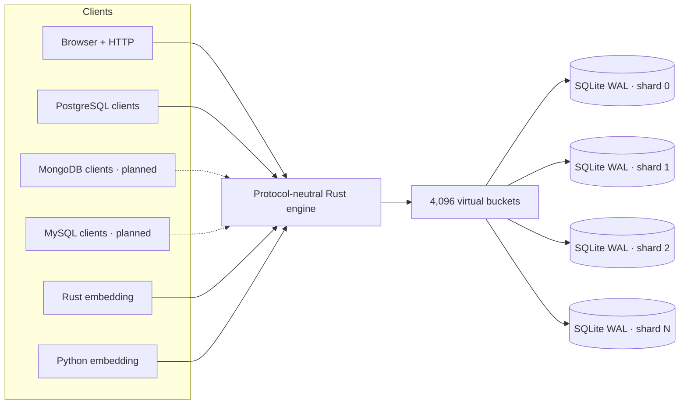
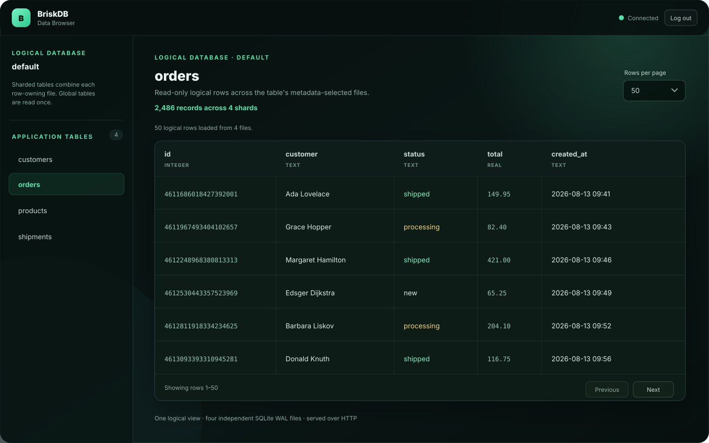

# BriskDB

[](https://github.com/schapman1974/briskdb/actions/workflows/ci.yml)
[](https://github.com/schapman1974/briskdb/actions/workflows/release.yml)
[](LICENSE)

> **SQLite grew up, learned to shard, and started speaking database protocols.**

BriskDB turns production-hardened SQLite into a small, fast, sharded database
engine. It keeps the durability, WAL, transactions, tooling, and boring
reliability developers already trust—then adds routing, parallel writer domains,
global reads, generated IDs, an HTTP API, and wire-protocol frontends.

**HTTP, bounded PostgreSQL queries, and in-process Rust and Python embedding
work today. Embedded hosts can optionally expose the same engine over loopback
HTTP and PostgreSQL. Native MongoDB, MySQL, and serverless use are on the roadmap.**

> [!WARNING]
> BriskDB is an alpha. It is exciting infrastructure, not yet a production-ready
> database service. The current unauthenticated listeners are loopback-only.

## Why developers might care

- **Sharding without an SQLite fork.** Every shard is an ordinary SQLite WAL
  database that existing tools can inspect and repair.
- **Real parallel writes.** Independent shard files mean independent SQLite
  writer locks—no single shared WAL for the whole cluster.
- **One logical database.** Exact keys route to one owner; broader reads gather
  bounded work across the right shards.
- **IDs without a central per-row bottleneck.** BriskDB can let SQLite
  `AUTOINCREMENT` allocate from non-overlapping shard ranges, or lease hi/lo ID
  blocks and route them through the normal shard map.
- **Bring the client you already have.** HTTP and PostgreSQL are available now;
  MongoDB and MySQL wire compatibility are being built over the same engine.
- **Files remain files.** The layout is a manifest plus normal SQLite databases,
  not a proprietary page format.

## One engine, many ways in



The protocol adapters do not own database semantics. Routing, limits,
cancellation, values, sessions, and execution live in the shared Rust engine,
leaving room for more protocols and storage adapters later.

## Browse the whole logical database



BriskDB serves a responsive, read-only data browser at `/admin`. It uses the
same bounded HTTP engine paths as other clients, combines sharded rows into one
logical view, reads global tables once, and preserves large integer values.

For the current local alpha:

```text
http://127.0.0.1:7654/admin
username: admin
password: admin
```

The temporary credentials are a development convenience—not a security
boundary—which is why the server currently refuses non-loopback HTTP addresses.

## The unusual part: shard-safe generated IDs

BriskDB has two generated-ID designs for sharded tables:

- **`native_range_v1`** gives every shard a non-overlapping positive 64-bit
  range. SQLite's own `INTEGER PRIMARY KEY AUTOINCREMENT` performs the actual
  allocation locally, with no central write for each inserted row.
- **`hilo_v1`** durably leases blocks of 4,096 IDs from the manifest, then
  allocates in memory and hash-routes each ID. Crashes may leave gaps, but an ID
  is never reused.

Both policies are versioned in the manifest. Generated-key execution is still
experimental and opt-in; the exact contract lives in
[Generated keys](docs/GENERATED_KEYS.md).

## What works now

| Capability | Alpha status |
| --- | --- |
| Durable virtual-bucket routing over independent SQLite WAL files | Working |
| Exact-key routing and bounded scatter/gather reads | Working |
| HTTP query/write API and admin data browser | Working, loopback-only |
| PostgreSQL wire protocol | Simple `SELECT`/`INSERT`/`UPDATE`/`DELETE` |
| Offline import from a standard SQLite database | Working |
| Native-range and hi/lo generated IDs | Experimental, opt-in |
| Ubuntu/macOS x86-64 and ARM64 release artifacts | Published |
| Debian package and hardened systemd service | Published |
| Rust library entrypoint with optional attached listeners | Working |
| Same-host service and embedded processes sharing one ready root | Working on local filesystems |
| Native MongoDB wire protocol with TinyMongo parity | [Planned](https://github.com/schapman1974/briskdb/issues/160) |
| MySQL wire protocol | [Planned](https://github.com/schapman1974/briskdb/issues/40) |
| Native Python extension | Sync/async API working; tagged releases build audited macOS/Linux ARM/x86 wheels |
| Serverless lifecycle | [Planned](https://github.com/schapman1974/briskdb/issues/194) |

## Try it in 30 seconds

BriskDB requires Rust 1.85 or newer:

```bash
cargo run --release -- --data-dir ./briskdb-data --shards 4
```

Then open the [data browser](http://127.0.0.1:7654/admin) or check the server:

```bash
curl http://127.0.0.1:7654/health
```

Enable the current PostgreSQL simple-query listener explicitly:

```bash
cargo run --release -- --postgres-listen 127.0.0.1:5433
psql -h 127.0.0.1 -p 5433 -d default
```

Registered tables can also be queried over HTTP:

```bash
curl -X POST http://127.0.0.1:7654/v1/query \
  -H 'content-type: application/json' \
  -d '{"sql":"SELECT id, name FROM widgets WHERE id = ?1","params":["widget-1"]}'
```

Have an existing SQLite database? Use the offline
[SQLite importer](docs/SQLITE_IMPORT.md). Prefer binaries? Download the latest
[GitHub release](https://github.com/schapman1974/briskdb/releases), including
macOS/Linux ARM64 and x86-64 archives plus Linux `.deb` packages.

Embedding in Rust starts with `BriskDb::open()` or the validated builder. The
[embedded Rust guide](docs/EMBEDDED_RUST.md) includes a complete listener-free
example. Choose a shard count when creating data; later opens detect it from
the manifest and reject explicit mismatches. Use `default-features = false` with the
`embedded` feature to leave the network and CLI stacks out; see the
[crate feature map](docs/CRATE_FEATURES.md).

Python can run the same engine directly in-process. It starts no listener by
default, but `Database.serve()` can attach loopback HTTP/PostgreSQL listeners:

```bash
python -m pip install ./python
```

```python
with briskdb.open("./data", shards=4) as db:
    with db.serve(postgres="127.0.0.1:0") as server:
        print(server.http_address, server.postgres_address)
```

See the [Python quickstart](python/README.md) for sync and asyncio write/read
examples. Tagged releases publish compiler-free `cp39-abi3` wheels for the
[supported platform matrix](python/COMPATIBILITY.md); repository checkouts can
still be installed from source with Rust 1.85+. Independently spawned Python,
Rust, and server processes can share a ready local data directory; read the
[multi-process contract](docs/MULTIPROCESS.md) before deploying that pattern.

## Still just inspectable files

```text
briskdb-data/
├── .briskdb-process.lock
├── .briskdb-startup.lock
├── manifest.sqlite
└── shards/
    ├── 0000.sqlite
    ├── 0001.sqlite
    ├── 0002.sqlite
    └── 0003.sqlite
```

The manifest versions routing, catalogs, migrations, generated-ID ownership,
and integrity metadata. Application rows stay in ordinary SQLite files.

## Where this is going

- **MongoDB:** a native Rust Mongo listener with BSON, queries, updates,
  indexes, cursors, aggregation, and differential TinyMongo parity.
- **More wire protocols:** PostgreSQL extended queries and MySQL compatibility,
  all sharing the same engine behavior.
- **Serverless storage:** atomic snapshots, object-store adapters, and fenced
  single-writer operation beyond today's embedded warm-handler pattern.
- **Future storage adapters:** SQLite is the first backend, while the engine
  boundaries are being kept reusable for other durable backends.

Follow the [roadmap](ROADMAP.md) or browse the
[open issues](https://github.com/schapman1974/briskdb/issues).

## Honest alpha boundaries

- No authentication, authorization, or TLS yet; listeners are loopback-only.
- No general atomic transaction across multiple shard files.
- Global ordering/pagination and general aggregate pushdown are still limited.
- The supported backup today is a stopped-server copy of the complete data
  directory after every server and embedder exits; online/serverless snapshots
  are planned.
- Multi-process access is same-host/local-filesystem only. Schema, catalog,
  upgrade, and recovery work requires sole-process ownership.
- Pre-1.0 storage and public-library compatibility can change between releases.
- Ubuntu 24.04 x86-64 receives the full required Rust CI suite. Python wheels
  receive native build, audit, install, restart, corruption, and concurrency
  checks on Linux/macOS x86-64 and ARM64.

## Go deeper

- [Architecture](docs/ARCHITECTURE.md)
- [Embedded Rust](docs/EMBEDDED_RUST.md)
- [Embedded SQL](docs/EMBEDDED_SQL.md)
- [Crate features and support tiers](docs/CRATE_FEATURES.md)
- [PostgreSQL quickstart](docs/POSTGRES_QUICKSTART.md)
- [SQL compatibility](docs/SQL_COMPATIBILITY.md)
- [Generated keys](docs/GENERATED_KEYS.md)
- [Storage format](docs/STORAGE_FORMAT.md)
- [Sharing one data directory between processes](docs/MULTIPROCESS.md)
- [Debian and systemd installation](docs/DEBIAN_INSTALL.md)
- [Pre-1.0 compatibility policy](docs/PRE_1_COMPATIBILITY.md)
- [Contributing](CONTRIBUTING.md)

BriskDB is available under the [MIT License](LICENSE).
