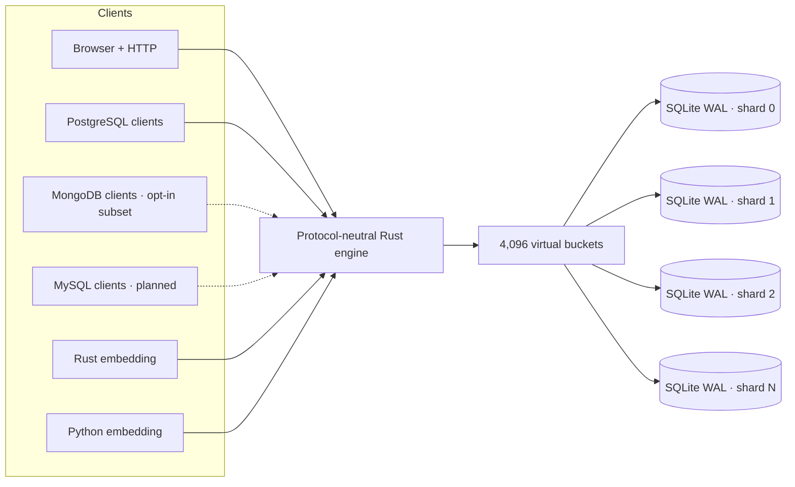

# BriskDB

[](https://github.com/schapman1974/briskdb/actions/workflows/ci.yml)
[](https://github.com/schapman1974/briskdb/actions/workflows/release.yml)
[](https://pypi.org/project/briskdb/)
[](LICENSE)

> **SQLite files. One sharded database.**

BriskDB turns ordinary SQLite files into one database with **parallel writes,
PostgreSQL compatibility, HTTP access, and embedded Rust/Python APIs**. It keeps
SQLite's proven storage engine and tooling; BriskDB adds the routing layer,
shard-safe IDs, cross-shard indexes, protocols, and operational guardrails.
An optional read-only addon also lets Python's standard `sqlite3` query BriskDB
tables through a local or remote server, using the same Python wheel.

<p align="center">
  
</p>

| The useful part | What it means |
| --- | --- |
| **Parallel SQLite writes** | Independent shard files have independent WAL writer locks. |
| **Use existing clients** | PostgreSQL and HTTP work today; an opt-in MongoDB subset is growing, and MySQL is planned. |
| **Embed or run a service** | The same Rust engine powers the binary, Python wheel, and Rust crate. |
| **Keep inspectable files** | Every data shard remains a normal SQLite database—no SQLite fork. |

[Try it without a compiler](#try-it-in-30-seconds) ·
[Use Python sqlite3](#use-python-sqlite3-with-briskdb) ·
[Download an alpha](https://github.com/schapman1974/briskdb/releases) ·
[Open the data browser](#browse-the-whole-logical-database) ·
[Follow MongoDB and MySQL](#follow-the-build)

> [!IMPORTANT]
> BriskDB is an alpha, not a production-ready database service. The
> [boundaries are explicit](#honest-alpha-boundaries), and measured results are
> published even when they are not flattering.

## Why developers might care

- **No SQLite fork.** Each shard is an ordinary SQLite WAL database that normal
  tools can inspect.
- **No central write lock.** Writes to different shards use different WALs and
  can progress in parallel.
- **No central ID write per row.** Native range and hi/lo allocation provide
  collision-free generated IDs across shards and processes.
- **Safe cross-shard pruning.** Global uniqueness is authoritative; asynchronous
  indexes use verification, watermarks, Bloom filters, and min/max summaries so
  an optimization cannot silently hide a row.
- **One engine everywhere.** PostgreSQL, HTTP, Rust, and Python share routing,
  limits, cancellation, errors, and storage behavior.
- **Operations are visible.** The separate loopback administration listener
  serves `/health`, `/metrics`, admin JSON, and the browser without exposing
  those handlers on the data listener.

## One engine, many ways in



The protocol adapters do not own database semantics. Routing, limits,
cancellation, values, sessions, and execution live in the shared Rust engine,
leaving room for more protocols and storage adapters later.

## Use Python sqlite3 with BriskDB

Use a real `sqlite3.Connection` and ordinary SQL to read tables on a BriskDB
server. `briskdb.attach_remote()` exposes them as SQLite virtual tables in the
`remote` schema; it does not replace Python's `sqlite3` driver or copy the
server's database files. SQLite runs joins, filters, and aggregates locally.

This addon is a **read-only preview on `main`**, not yet published to PyPI.
From a checkout of this repository, install it with Python 3.9+ and Rust 1.85+:

```bash
python -m pip install ./python
```

Your Python interpreter must have SQLite 3.31+ with extension-loading support.
Some macOS Python builds disable it; extension-enabled Homebrew Python 3.14 is
tested. See the [host requirements](python/COMPATIBILITY.md#remote-sqlite-host-requirements).

### Connect to an existing server

Use the server's HTTPS origin and bearer token. The server must explicitly
enable the SQLite remote connector and allow access to `users`:

```python
import os
import sqlite3
from contextlib import closing

import briskdb

with closing(sqlite3.connect(":memory:")) as conn:
    with briskdb.attach_remote(
        conn, "https://db.example.com", token=os.environ["BRISKDB_TOKEN"]
    ):
        rows = conn.execute(
            "SELECT id, name FROM remote.users WHERE id = ?", (123,)
        ).fetchall()
        print(rows)
```

### Try the complete round trip locally

This self-contained example creates temporary data, starts an authenticated
BriskDB listener, queries it through `sqlite3`, and closes everything afterward:

```python
import secrets
import sqlite3
import tempfile
from contextlib import closing

import briskdb

token = secrets.token_urlsafe(32)

with tempfile.TemporaryDirectory(prefix="briskdb-sqlite3-") as data_dir:
    with briskdb.open(data_dir, shards=2) as db:
        with db.session(routing_key="demo") as session:
            session.migrate("CREATE TABLE users (id INTEGER PRIMARY KEY, name TEXT)")
            session.execute(
                "INSERT INTO users (id, name) VALUES (?1, ?2)", [123, "Ada"]
            )

        with db.serve(
            admin=None,
            sqlite_remote_token=token,
            sqlite_remote_tables=["users"],
            sqlite_remote_routing_key="demo",
        ) as server:
            with closing(sqlite3.connect(":memory:")) as conn:
                with briskdb.attach_remote(
                    conn, f"http://{server.http_address}", token=token
                ):
                    print(conn.execute(
                        "SELECT id, name FROM remote.users WHERE id = ?", (123,)
                    ).fetchall())  # [(123, 'Ada')]
```

The setup writes through BriskDB; the `sqlite3` connection only reads. This
fresh, uncataloged demo uses `sqlite_remote_routing_key="demo"` to expose one
routed shard—not the whole database and not a row-level permission filter.
For **registered logical tables**, omit that argument: BriskDB uses their
normal shard placement across the database.

For access from another machine, keep the connector bound to loopback and
publish **only its dedicated data listener** through a trusted HTTPS reverse
proxy. Plain HTTP is accepted only for literal loopback IPs. Keep the token
secret; do not publish the separate admin or ordinary SQL HTTP listeners.

Current limits: read-only full scans of at most 4,096 rows, 1 MiB of engine
results, and an 8 MiB response (or stricter engine settings). `WHERE` and
`LIMIT` run locally and do not bypass those scan limits. There are no remote
writes, paged cursors, shared transaction snapshots, or hidden rowids yet.
See the [SQLite addon API](python/API.md#remote-sqlite-addon) for the full
contract and [#349](https://github.com/schapman1974/briskdb/issues/349) for the
remaining work.

## Browse the whole logical database


BriskDB serves a responsive, read-only data browser at `/admin` on its separate
administration listener. It uses the same bounded engine paths as other
clients, combines sharded rows into one logical view, reads global tables once,
and preserves large integer values.

For the current local alpha:

```text
http://127.0.0.1:7655/admin
username: admin
password: admin
```

The temporary credentials are a development convenience—not a security
boundary—which is why both HTTP listeners currently require loopback addresses.

## The unusual part: shard-safe generated IDs

BriskDB has two generated-ID designs for sharded tables:

- **`native_range_v1`** gives every shard a non-overlapping positive 64-bit
  range. SQLite's own `INTEGER PRIMARY KEY AUTOINCREMENT` performs the actual
  allocation locally, with no central write for each inserted row.
- **`hilo_v1`** durably leases blocks of 4,096 IDs from the manifest, then
  allocates in memory and hash-routes each ID. Crashes may leave gaps, but an ID
  is never reused.

Both policies are versioned in the manifest. Generated-key execution is still
experimental and opt-in; the exact contract lives in
[Generated keys](docs/GENERATED_KEYS.md).

## What works now

| Capability | Alpha status |
| --- | --- |
| Durable virtual-bucket routing over independent SQLite WAL files | Working |
| Exact-key routing and bounded scatter/gather reads | Working |
| HTTP query/write API, operational API, and admin data browser | Working on separate loopback-only data/admin listeners; request correlation, bounded NDJSON rows, request-local result limits, eligible-write durable replay, readiness, inspection, cancellation, stopped-copy capability, and passive checkpoint are versioned |
| PostgreSQL wire protocol | TLS/SCRAM, backpressured row streaming, SQLite-interrupt cancellation, text/binary CRUD, real single-shard transactions, and a live psql/tokio-postgres/psycopg/SQLAlchemy matrix |
| Offline import from a standard SQLite database | Working |
| Native-range and hi/lo generated IDs | Experimental, opt-in |
| Cross-shard indexes and global value leases | Experimental/opt-in: correctness, recovery, and shard pruning pass; current latency/write overhead is documented in the release gate |
| Global-index health and Prometheus metrics | Admin listener `/health`, `/v1/admin/global-indexes`, `/metrics`, plus Rust operational reports |
| Ubuntu/macOS x86-64 and ARM64 release artifacts | Published |
| Debian package and hardened systemd service | Published |
| Rust library entrypoint with optional attached listeners | Working; the opt-in `documents` feature adds a thin native document-command facade |
| Same-host service and embedded processes sharing one ready root | Working on local filesystems |
| Native MongoDB wire protocol with TinyMongo parity | Opt-in loopback discovery, queries/cursors, basic aggregation, metadata, unique indexes and safe equality candidates, deletes, replacement/operator upserts (including find-and-modify), and field/array updates share the [document engine](docs/DOCUMENT_ENGINE.md); full [Mongo parity](docs/MONGO_PARITY.md), whole-bulk post-image semantics and broader query planning remain [in progress](https://github.com/schapman1974/briskdb/issues/160) |
| MySQL wire protocol | [Planned](https://github.com/schapman1974/briskdb/issues/40) |
| Native Python extension | Typed sync/async SQL and opt-in BSON document commands; tagged releases build audited macOS/Linux ARM/x86 wheels |
| Python's standard `sqlite3` | [Read-only remote addon](#use-python-sqlite3-with-briskdb) on `main`; authenticated table access, parameters and local joins; not yet published to PyPI |
| Serverless lifecycle | [Planned](https://github.com/schapman1974/briskdb/issues/194) |

## Where BriskDB fits

These projects solve different problems. This table is a compass, not a
benchmark scoreboard.

| Project | Built for | Write model | Access | Storage shape |
| --- | --- | --- | --- | --- |
| **BriskDB** | Same-host sharding, service + embedding | Parallel across independent shard WALs | PostgreSQL, HTTP, Rust, Python | Manifest + ordinary SQLite shard files |
| [SQLite](https://sqlite.org/wal.html) | Small, embedded, single-file databases | One writer per WAL file | SQLite API and ecosystem | One ordinary SQLite file |
| [rqlite](https://rqlite.io/docs/features/) | Simple multi-node availability | Writes flow through a Raft log; optimized for HA, not write scaling | HTTP + client libraries | Replicated SQLite state across nodes |
| [Turso / libSQL](https://docs.turso.tech/sdk/introduction) | Cloud/edge access and local-first sync | Product-dependent primary or local push/pull model | SDKs + HTTP | Turso Database or legacy SQLite-compatible libSQL |
| [Citus](https://www.postgresql.org/about/news/citus-120-released-2687/) | Mature distributed PostgreSQL | Parallel across PostgreSQL worker shards | PostgreSQL | PostgreSQL coordinator + worker cluster |

Choose BriskDB when you want one local service or embedded engine to spread
write contention across inspectable SQLite files while speaking familiar
database protocols. Choose the others when a single SQLite file, replicated
high availability, managed edge sync, or a mature multi-node PostgreSQL cluster
is the real requirement.

## Try it in 30 seconds

Install the published native wheel—no clone and no Rust compiler:

```bash
python -m pip install --only-binary=:all: briskdb
curl -fsSLO https://raw.githubusercontent.com/schapman1974/briskdb/main/examples/launch_demo.py
python launch_demo.py
```

The demo makes 32 routed writes from four Python threads, proves that all four
ordinary SQLite shard files received rows, reads every row back, checks HTTP
health, and starts the PostgreSQL listener. It uses a temporary directory and
cleans up after itself. The GIF renderer executes this exact scenario, and CI
tests it against every published wheel target.

To run the standalone service, download the matching macOS/Linux ARM64 or
x86-64 archive from the [latest GitHub release](https://github.com/schapman1974/briskdb/releases),
then:

```bash
./briskdb --data-dir ./briskdb-data --shards 4
```

Open the [data browser](http://127.0.0.1:7655/admin) or inspect the service on
the separate administration listener:

```bash
curl http://127.0.0.1:7655/health
curl http://127.0.0.1:7655/v1/ready
curl http://127.0.0.1:7655/v1/admin/catalog
curl http://127.0.0.1:7655/metrics
```

Enable the PostgreSQL listener explicitly. Simple and parameterized
text/binary prepared queries share the same bounded engine path:

```bash
./briskdb --data-dir ./briskdb-data --postgres-listen 127.0.0.1:5433
psql -h 127.0.0.1 -p 5433 -d default
```

That local development form is unauthenticated and therefore loopback-only.
The [PostgreSQL quickstart](docs/POSTGRES_QUICKSTART.md) shows the four settings
for TLS plus SCRAM-SHA-256; secure mode is required for any remote bind.

### Use PyMongo with the opt-in Mongo listener

Build from source with the non-default `mongo` feature, then explicitly enable
the listener. This is a growing MongoDB subset, not full MongoDB compatibility:

```bash
cargo run --locked --features mongo --bin briskdb -- \
  --data-dir ./briskdb-data --shards 4 --mongo-listen 127.0.0.1:27017
```

In another terminal, after installing `pymongo`:

```python
from pymongo import MongoClient

with MongoClient("mongodb://127.0.0.1:27017/?directConnection=true") as client:
    client.demo.users.update_one(
        {"_id": 123}, {"$set": {"name": "Ada"}}, upsert=True
    )
    print(client.demo.users.find_one({"_id": 123}))
```

`BRISKDB_MONGO_LISTEN` is the environment equivalent; `--mongo-listen disabled`
overrides it. Mongo is disabled by default, including in Mongo-enabled builds.
Builds without the feature reject activation before opening database files.
The listener is **unauthenticated and loopback-only**; do not expose it through
a public proxy. HTTP/PostgreSQL and Mongo share the engine and lifecycle, but
SQL tables and BSON collections remain separate data models. Ctrl-C/SIGTERM
drains all enabled listeners and closes the database. See the
[Mongo compatibility contract](docs/MONGO_PARITY.md#current-wire-checkpoint)
for supported operations, limits, and the Rust attached-server API.
To opt into bounded zlib transport, add `compressors="zlib"` to `MongoClient`
or `AsyncMongoClient`; default connections remain uncompressed.

The Python package built from this checkout can host the same listener, without
a separate daemon. Install `./python` and `pymongo`, then:

```python
import briskdb
from pymongo import MongoClient

with briskdb.open("./briskdb-data", shards=4, documents=True) as db:
    with db.serve(mongo="127.0.0.1:0") as server:
        with MongoClient(f"mongodb://{server.mongo_address}") as client:
            client.demo.users.update_one(
                {"_id": 123}, {"$set": {"name": "Ada"}}, upsert=True
            )
            print(client.demo.users.find_one({"_id": 123}))
```

`mongo=None` is the default; `documents=True` must be set when opening the
database. `await db.serve(mongo=...)` also works with `AsyncDatabase`. Closing
the server leaves the database running; closing the database drains its servers.
Mongo remains loopback-only even alongside TLS/SCRAM PostgreSQL or authenticated
SQLite remote. Their credentials do not secure the Mongo port.

### Use existing PyMongo code with the BriskDB wheel

The wheel built from this checkout supports TinyMongo-style usage without a
separate database process. Install from the repository root:

```bash
python -m pip install './python[pymongo]'
```

Patch existing PyMongo code for an isolated test:

```python
import briskdb
import pymongo

with briskdb.patch():
    # Import application modules that capture MongoClient inside this scope.
    client = pymongo.MongoClient("mongodb://ignored.example.com")
    client.app.users.insert_one({"_id": 1, "name": "Ada"})
    print(client.app.users.find_one({"_id": 1}))
```

`patch()` without a folder uses isolated **temporary SQLite files**, deleted
on exit. Use `briskdb.patch(folder="./test-data")` to keep data between runs.
PyMongo's constructors are restored and scope-created clients are closed even
if application code raises.

Use a persistent client directly, without patching PyMongo:

```python
from briskdb import MongoClient

with MongoClient(folder="./app-data") as client:
    client.app.users.update_one({"_id": 1}, {"$set": {"name": "Ada"}}, upsert=True)
    print(list(client.app.users.find({"name": "Ada"})))
```

Patch async PyMongo code with an async scope:

```python
import asyncio
import briskdb
import pymongo

async def main():
    async with briskdb.patch():
        client = pymongo.AsyncMongoClient()
        await client.app.users.insert_one({"_id": 1, "name": "Ada"})
        print(await client.app.users.find_one({"_id": 1}))

asyncio.run(main())
```

These are real PyMongo 4.17 clients using the wheel's Rust engine and one private
loopback Mongo socket—**no separate daemon or HTTP/admin listeners**. Supplied
Mongo hosts, credentials, TLS and topology settings are not used remotely.
Existing clients and aliases imported before patch entry are unchanged, so patch
**before importing your application**. This adds integration convenience, not
new Mongo queries or TinyMongo's alternative storage backends. See
[patching and async examples](python/README.md#patch-pymongo-for-local-testing).

### Query registered SQL tables over HTTP

Registered tables can also be queried over HTTP:

```bash
curl -X POST http://127.0.0.1:7654/v1/query \
  -H 'content-type: application/json' \
  -d '{"sql":"SELECT id, name FROM widgets WHERE id = ?1","params":["widget-1"]}'
```

The [versioned HTTP contract](docs/HTTP_API.md) defines requests, response
shapes, value encodings, request IDs, eligible-write idempotency, bounded row
streaming, limits, and errors. `GET /v1` reports the supported API version and
configured result ceilings.
The checked [OpenAPI 3.1 artifact](docs/OPENAPI.md) describes the exact v1
machine surface from the same route and DTO definitions and is included in
Cargo, native archive, and Debian distributions.
The [HTTP listener contract](docs/HTTP_LISTENERS.md) defines the strict route
split, configuration, and shared startup/shutdown behavior. The data listener
defaults to `127.0.0.1:7654`; administration defaults to
`127.0.0.1:7655` and can be disabled with `--admin-listen disabled`.

Have an existing SQLite database? Use the offline
[SQLite importer](docs/SQLITE_IMPORT.md). Linux releases also include `.deb`
packages with a hardened systemd service.

Embedding in Rust starts with `BriskDb::open()` or the validated builder. The
[embedded Rust guide](docs/EMBEDDED_RUST.md) includes a complete listener-free
example. Choose a shard count when creating data; later opens detect it from
the manifest and reject explicit mismatches. Use `default-features = false`
with the `embedded` feature for SQL-only embedding. Select `documents` and
explicitly enable `DocumentSupport` to submit native BSON commands through
`BriskDb` or an owned `BriskSession`. Both forms use the same document engine
and routing plans as future protocol adapters; see the
[crate feature map](docs/CRATE_FEATURES.md).

Python runs the same engine directly in-process. It starts no listener by
default, but `Database.serve()` can attach data HTTP, administration HTTP, and
PostgreSQL listeners (remote PostgreSQL requires its TLS/SCRAM arguments):

```python
with briskdb.open("./data", shards=4) as db:
    with db.serve(postgres="127.0.0.1:0") as server:
        print(server.data_address, server.admin_address, server.postgres_address)
```

The wheel also exposes the current protocol-neutral document slice through
sync and asyncio sessions. Install PyMongo for its BSON value classes, then
enable document commands on the database handle:

```bash
python -m pip install briskdb pymongo
```

```python
from bson import ObjectId
import briskdb

with briskdb.open("./data", shards=4, documents=True) as db:
    with db.session() as session:
        session.create_collection("app", "notes")
        note_id = ObjectId()
        session.insert_one("app", "notes", {"_id": note_id, "body": "hello"})
        print(session.find("app", "notes", {"_id": note_id})["documents"])
```

PyMongo remains optional and is loaded only when a document method runs, so a
SQL-only installation has no BSON dependency. The current slice supports
collection/index metadata, single-document inserts with optional `_id`, BSON
find/count/distinct, basic aggregation and retained cursors, filtered deletes,
replacements, field/array updates, and projected before/after mutation images.
Secondary index declarations remain
`pending_build`.

See the [Python quickstart](python/README.md) for sync and asyncio write/read
examples and the [Python value contract](python/VALUE_CONVERSIONS.md) for BSON,
datetime, UUID, and error behavior. Tagged releases publish compiler-free
`cp39-abi3` wheels for the
[supported platform matrix](python/COMPATIBILITY.md); repository checkouts can
still be installed from source with Rust 1.85+. Independently spawned Python,
Rust, and server processes can share a ready local data directory; read the
[multi-process contract](docs/MULTIPROCESS.md) before deploying that pattern.

## Still just inspectable files

```text
briskdb-data/
├── .briskdb-process.lock
├── .briskdb-startup.lock
├── manifest.sqlite
├── global-indexes/
│   └── global.sqlite
└── shards/
    ├── 0000.sqlite
    ├── 0001.sqlite
    ├── 0002.sqlite
    └── 0003.sqlite
```

The manifest versions routing, catalogs, migrations, generated-ID ownership,
and integrity metadata. Application rows stay in ordinary SQLite files.

## Where this is going

- **MongoDB:** extend the shared matcher and opt-in Rust listener with write,
  index, cursor, and aggregation semantics, then prove differential TinyMongo
  parity across embedded and wire clients.
- **More wire protocols:** broader PostgreSQL client compatibility and a MySQL
  listener, all sharing the same engine behavior.
- **Serverless storage:** atomic snapshots, object-store adapters, and fenced
  single-writer operation beyond today's embedded warm-handler pattern.
- **Future storage adapters:** SQLite is the first backend, while the engine
  boundaries are being kept reusable for other durable backends.

Follow the [roadmap](ROADMAP.md) or browse the
[open issues](https://github.com/schapman1974/briskdb/issues).

## Follow the build

Star BriskDB if you want to follow any of these bets:

- a native MongoDB wire protocol with large-app TinyMongo parity;
- MySQL compatibility over the same protocol-neutral Rust engine;
- serverless snapshots and object-store-backed lifecycle;
- more storage backends without giving up the ordinary SQLite option; or
- honest benchmark and failure evidence as the alpha becomes a real release.

If you try it, an issue with your client, workload, or missing SQL shape is even
more valuable than a star. Start with the
[alpha releases](https://github.com/schapman1974/briskdb/releases), then tell us
[what broke or what surprised you](https://github.com/schapman1974/briskdb/issues/new/choose).

## Honest alpha boundaries

- PostgreSQL has TLS and single-identity SCRAM-SHA-256 authentication, but no
  roles or authorization yet. The separated HTTP data and administration
  listeners remain loopback-only development surfaces.
- No general atomic transaction across multiple shard files.
- Global ordering/pagination and general aggregate pushdown are still limited.
- HTTP offers bounded row streaming but no retained cursor, continuation token,
  cross-shard snapshot, or new global `ORDER BY`/`OFFSET`/`LIMIT` semantics.
- The supported backup today is a stopped-server copy of the complete data
  directory after every server and embedder exits. Passive checkpoints now
  report shards, manifest, and global-index storage through both Rust and the
  administration API, but are not an online snapshot. The backup capability
  endpoint reports this limitation rather than copying live files;
  online/serverless snapshots are planned.
- Multi-process access is same-host/local-filesystem only. Schema, catalog,
  upgrade, and recovery work requires sole-process ownership.
- Pre-1.0 storage and public-library compatibility can change between releases.
- Python document commands support bounded BSON queries, basic aggregation,
  metadata/cursors, filtered deletes, replacements, and field/array updates.
  Replacement, update-one/many, and find-and-modify upserts are supported; other update operators,
  native Python bulk-write helpers and broader index-backed plans
  remain planned. Explicit `build_index` builds maintained entries;
  PyMongo `create_index` / `create_indexes` also build ordinary, compound, sparse
  and partial indexes, including `unique=True`. Unique keys are enforced across
  shards for every record write; duplicates fail with code 11000. Builds require
  sole-process ownership. Complete
  supported equality tuples use Ready index candidates with full BSON matching;
  non-unique indexes accept nested/object/array and other valid BSON values,
  retaining conservative candidates when a value has no ordinary equality key.
  Mixed PyMongo index models also accept non-unique hashed keys as equality
  indexes and TTL/background options with explicit reduced-behavior warnings;
  **TTL does not expire data**. Non-unique text declarations are explicitly
  skipped, not built; `$text` queries remain unsupported.
  See [index compatibility](docs/MONGO_PARITY.md#current-wire-checkpoint).
  Partial indexes, sparse all-null queries and unsupported shapes retain scans.
  PyMongo `drop_index` / `drop_indexes` remove secondary indexes
  without deleting documents; `_id_` remains protected. Multi-document writes commit per shard,
  without global atomicity or MongoDB per-document failure-boundary guarantees.
  Bulk updates may reject temporary key collisions even when their eventual
  post-image would be unique; that TinyMongo parity work remains open.
- Ubuntu 24.04 x86-64 receives the full required Rust CI suite. Python wheels
  receive native build, audit, install, restart, corruption, and concurrency
  checks on Linux/macOS x86-64 and ARM64.
- Global-index operational metrics are available, but BriskDB still lacks the
  broader production suite for traces, slow-query logs, resource saturation,
  alert rules, and long-running capacity validation.

## Go deeper

- [Architecture](docs/ARCHITECTURE.md)
- [OpenAPI v1 artifact](docs/OPENAPI.md)
- [HTTP listener separation](docs/HTTP_LISTENERS.md)
- [Global uniqueness and value authority](docs/GLOBAL_INDEX_AUTHORITY.md)
- [Global-index production gate](docs/GLOBAL_INDEX_RELEASE_GATE.md)
- [Embedded Rust](docs/EMBEDDED_RUST.md)
- [Embedded SQL](docs/EMBEDDED_SQL.md)
- [Python sqlite3 quickstart](#use-python-sqlite3-with-briskdb)
- [Remote SQLite addon API](python/API.md#remote-sqlite-addon)
- [Crate features and support tiers](docs/CRATE_FEATURES.md)
- [PostgreSQL quickstart](docs/POSTGRES_QUICKSTART.md)
- [Tested PostgreSQL clients](docs/POSTGRES_CLIENTS.md)
- [Mongo compatibility parity contract](docs/MONGO_PARITY.md)
- [BSON value and codec contract](docs/BSON.md)
- [Document catalog, storage, and TinyMongo import](docs/DOCUMENT_STORAGE.md)
- [Protocol-neutral document engine](docs/DOCUMENT_ENGINE.md)
- [SQL compatibility](docs/SQL_COMPATIBILITY.md)
- [Generated keys](docs/GENERATED_KEYS.md)
- [Storage format](docs/STORAGE_FORMAT.md)
- [Sharing one data directory between processes](docs/MULTIPROCESS.md)
- [Debian and systemd installation](docs/DEBIAN_INSTALL.md)
- [Pre-1.0 compatibility policy](docs/PRE_1_COMPATIBILITY.md)
- [Contributing](CONTRIBUTING.md)

BriskDB is available under the [MIT License](LICENSE).
