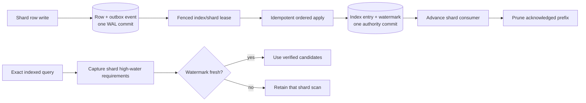

# Asynchronous global-index maintenance

Ready non-unique global indexes are maintained from the version-1 event stream
inside each source shard. The row and event commit together; applying the event
and advancing its authority watermark commit together in
`global-indexes/global.sqlite`.



## Correctness contract

- A per-index, per-shard lease has a random owner, expiry, and monotonic fence.
  A stale process cannot commit after another process takes over.
- Entry changes and `applied_cursor` share one immediate authority transaction.
  Replaying after a crash sees the committed watermark or redoes the rolled-back
  transaction; it cannot double-apply a logical event.
- Each query captures an outbox high-water vector. A shard is excluded only
  when its poison-free watermark covers that shard's requirement. Lag therefore
  costs extra SQLite scans, never missing rows.
- Ready [Bloom/min-max summaries](GLOBAL_INDEX_SHARD_SUMMARIES.md) may then
  prove that a lagging shard cannot match the bound equality, `IN`, or range.
  Verified candidates stay protected and unhealthy summary state retains the
  scan.
- Applied shard cursors advance only after the authority commit. A crash in
  between is harmless: restart reads from the authority watermark and repairs
  the acknowledgement.
- Pruning remains bounded by the slowest active consumer. A cursor behind a
  pruned prefix is fenced as `rebuild_required`.

Storage records applied-event totals, failures, last-batch event count and
duration, poison cursor, current lag, and lease fence. Keys, locators, worker
IDs, and application values are not exposed by status or debug output.

## Rust operation

The standalone server starts a managed worker automatically. Embedded callers
choose when to start and stop one:

```rust
let mut worker = database.start_global_index_worker(Default::default())?;
let status = database.global_index_async_status(index_id)?;
database.pause_global_index_async(index_id)?;
database.resume_global_index_async(index_id)?;
worker.stop();
```

`process_global_index_async` performs one bounded pass for applications that
prefer their own scheduler. More than one worker or process may run safely.
`GlobalIndexAsyncOptions` bounds batch size, lease duration, and idle polling.

Writes to ready globally indexed tables should use the shared `Engine` path
used by Rust, Python, HTTP, and PostgreSQL so the row and outbox event share one
transaction. A legacy synchronous `Database::execute` write fences each
affected non-unique index as `rebuild_required` before SQLite; queries scan
safely until an operator rebuilds it. Ready or invalid unique indexes reject
that uncoordinated path before mutation.

A poison event stops only its index/shard stream and remains visible in status.
Pause and resume do not discard it. Use the existing offline
`rebuild_global_index` workflow to reconstruct source truth, reset watermarks,
clear poison state, and reactivate every shard consumer.

## Performance evidence

On the Apple M1 Pro development host, the release-mode Criterion group measured
a one-event catch-up pass at 3.99 ms median (251 events/s) and a write plus
immediate apply at 9.45 ms median (106 operations/s). The background design
keeps that authority work off the foreground shard commit. Fresh-miss and
one-shard-lag hybrid planning measured 3.60 ms and 3.63 ms respectively; the
lag check added about 0.6% in this small four-shard fixture. These are local
engineering measurements, not capacity guarantees.
