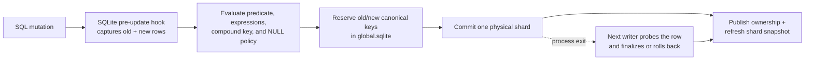
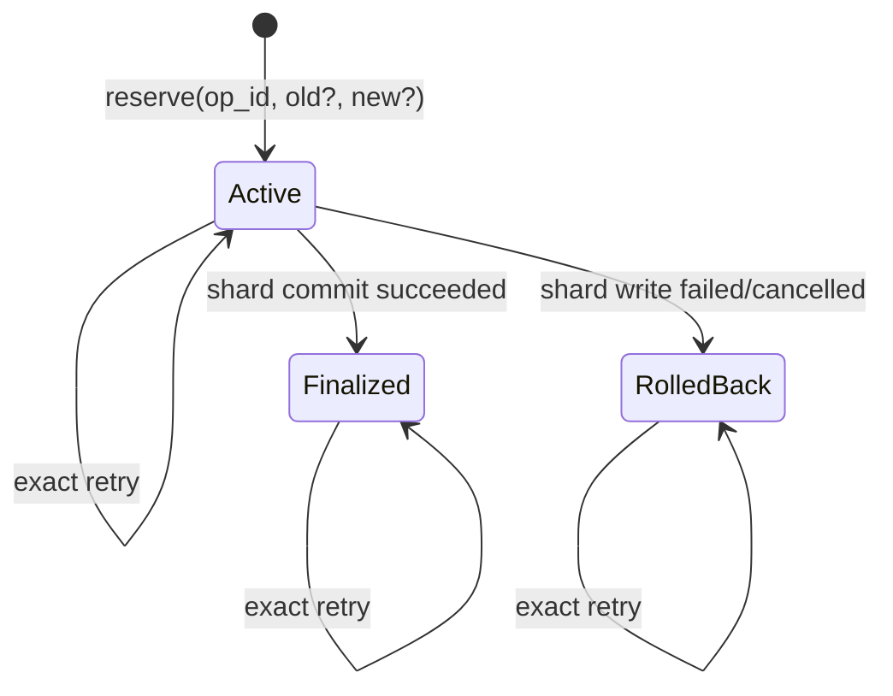

# Global uniqueness and value authority

BriskDB now has protocol-neutral primitives for enforcing a unique key across
all SQLite shards and leasing collision-free global integer values. They are
safe across service, Rust, and Python processes sharing one local data root.

Ready unique indexes are maintained automatically for successful autocommit
`INSERT`, `UPDATE`, and `DELETE` statements through the shared Rust engine. The
same path serves the Rust and Python libraries, HTTP, and PostgreSQL.

## Coordinated SQL writes



The hook is part of BriskDB's bundled SQLite build; it is not a loadable SQLite
extension. Cascades and `REPLACE` side effects are captured at the physical-row
boundary, so authority follows what SQLite actually changed. A durable
per-operation marker and file lock distinguish a live coordinator from an
orphaned write across independent processes.

The alpha path deliberately accepts only mutations whose atomicity it can
prove. One statement may change at most one authoritative row per global index,
and the write must stay on one physical shard. Explicit transactions on indexed
tables, `ON CONFLICT DO UPDATE`, and cross-shard `INSERT OR REPLACE` conflicts
return `Unsupported` before commit. `INSERT OR IGNORE` returns zero affected
rows on a global conflict. These restrictions avoid silently partial writes.

Maintenance is synchronous and currently refreshes the affected index/shard
snapshot before acknowledging the write. This favors correctness over write
throughput in the alpha; the outbox and asynchronous-index stages tracked by
[#236](https://github.com/schapman1974/briskdb/issues/236) and
[#237](https://github.com/schapman1974/briskdb/issues/237) are the planned
throughput path. Global-index query routing begins in
[#234](https://github.com/schapman1974/briskdb/issues/234).

## Unique-key state machine



`reserve_global_unique` locks every affected canonical key in one immediate
SQLite transaction. A claim conflicts with both a finalized owner and another
active reservation. A replacement locks the old and new keys together, proves
the exact old shard/row owner, and therefore cannot exchange or steal keys.
`finalize_global_unique` atomically publishes the new owner and releases the old
one; `rollback_global_unique` only releases the locks.

The caller supplies a nonzero 16-byte `GlobalOperationId`. Repeating the exact
request returns its durable state. Reusing the ID for another request returns
`InvalidArgument`; key contention returns the stable `UniqueViolation` error.
Keys and row locators are never printed in diagnostics or `Debug` output.

## Global value leases

`lease_global_values` reserves 1–65,536 positive values from a ready, unique,
single-integer global index. One SQLite transaction advances the durable head,
increments its fence token, and records the exact range under the operation ID.
Concurrent processes therefore receive disjoint ranges.

Leases are irrevocable. Finalizing records successful consumption; abandoning,
rolling back a shard write, losing a response, or crashing may leave gaps, but
values are never reused. Exhaustion is a non-retryable `LimitExceeded` error.
SQLite lock timeouts remain retryable `Busy`, and cancellation before a durable
commit returns `Cancelled` without changing state.

## Recovery and maintenance

An active operation survives a process exit. The write coordinator probes the
recorded physical row identity, then finalizes a committed mutation or rolls
back an uncommitted one; there is no scan-then-insert race. Offline validation
reports `active_unique_reservation`. A unique-index rebuild rolls active
reservations back before reconstructing ownership from the authoritative shard
rows.

Physical global-index storage version 2 adds the operation, reservation,
sequence, and lease tables to `global-indexes/global.sqlite`. Startup upgrades
version 1 atomically and requires sole-process ownership; a live peer receives
retryable `Busy` before any format mutation.

## Verification and benchmarks

The test suite covers deterministic transitions, old/new mutation planning,
partial/compound/NULL key derivation, constraint outcomes, competing-process
insert/update/delete races and exact retries, Python and PostgreSQL clients,
replacement locking, serial-model property histories, four-process hot-key
contention, four-process range leasing, durable process-abort boundaries,
format-upgrade crashes, and peer fencing.

Criterion includes three focused measurements:

```bash
cargo bench --bench storage -- global_authority
```

- uncontended reserve + finalize;
- finalized hot-key rejection;
- 64-value lease + finalize.
