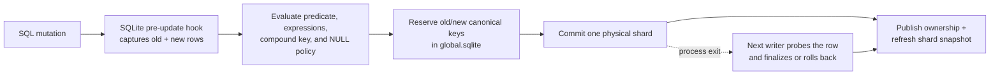
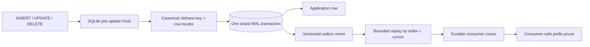
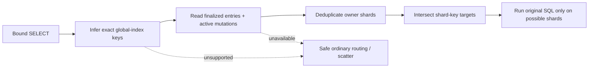
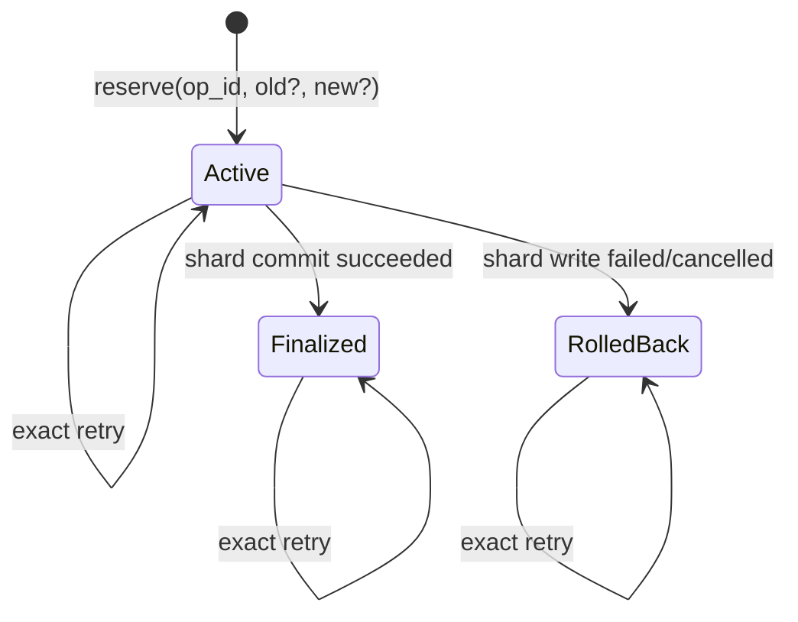

# Global uniqueness and value authority

BriskDB now has protocol-neutral primitives for enforcing a unique key across
all SQLite shards and leasing collision-free global integer values. They are
safe across service, Rust, and Python processes sharing one local data root.

Ready unique indexes are maintained automatically for successful autocommit
`INSERT`, `UPDATE`, and `DELETE` statements through the shared Rust engine. The
same path serves the Rust and Python libraries, HTTP, and PostgreSQL.
Legacy synchronous `Database::execute` writes fence ready non-unique indexes for
rebuild before mutation; ready or invalid unique indexes reject that path.

## Coordinated SQL writes



The hook is part of BriskDB's bundled SQLite build; it is not a loadable SQLite
extension. Cascades and `REPLACE` side effects are captured at the physical-row
boundary, so authority follows what SQLite actually changed. A durable
per-operation marker and file lock distinguish a live coordinator from an
orphaned write across independent processes.

The alpha path deliberately accepts only mutations whose atomicity it can
prove. One statement may change at most one authoritative row per global index,
and the write must stay on one physical shard. Explicit transactions on indexed
tables, `ON CONFLICT DO UPDATE`, and cross-shard `INSERT OR REPLACE` conflicts
return `Unsupported` before commit. `INSERT OR IGNORE` returns zero affected
rows on a global conflict. These restrictions avoid silently partial writes.

Unique maintenance remains synchronous and refreshes the affected index/shard
snapshot before acknowledging the write. Non-unique maintenance now writes a
versioned event into the owning shard's outbox in the same SQLite transaction
as the row. It therefore adds no independent commit or fsync and cannot publish
an event for a rolled-back row. Fenced asynchronous consumers now apply those
events and publish durable per-shard freshness watermarks; see
[asynchronous global indexes](GLOBAL_INDEX_ASYNC.md).

## Transactional non-unique outbox



Each shard has one monotonic cursor shared by all non-unique indexes. Events
carry the index ID, source shard, nonzero operation ID, canonical old/new keys,
stable old/new locators, and `insert`, `update`, `delete`, or `tombstone` kind.
Replay is bounded to 4,096 events. A consumer cursor is durable across reopen,
and pruning cannot cross the slowest active consumer. Retention is capped at
1,000,000 events or 256 MiB per shard; a full outbox returns retryable `Busy`
from the row write instead of dropping index work. Removing an index first
deactivates its consumer so it cannot retain events forever.

The outbox is ordinary STRICT SQLite schema created lazily inside the first
qualifying row transaction. It uses the bundled SQLite engine and pre-update
hook, not a loadable plugin. Independent processes serialize cursor allocation
through the same shard WAL writer lock and observe one gap-free commit order.

## Exact indexed reads

Ready unique indexes now route eligible equality and `IN` reads to the exact
owner shard set. Compound indexes require a finite value set for every key
part; those sets are expanded under a 1,024-key planning bound. Existing
shard-key routes are intersected with index owners, and the original SQL still
runs on each selected SQLite shard, so the index never substitutes for SQLite's
row filtering.



Ready non-unique column indexes can also supply candidates. BriskDB reads at
most 4,096 candidates, fetches each by its stable physical locator, recomputes
the canonical key, and evaluates the complete original predicate on that
shard. Deleted, moved, malformed, and no-longer-matching candidates are never
returned as index evidence. Up to 64 stale observations per plan become
idempotent durable tombstones; applied tombstones are skipped on later reads.

Non-unique candidates are combined with a query-time outbox high-water vector.
Fresh shards use verified candidates; lagging, poisoned, or uninitialized
shards retain their ordinary scan. A partially fresh plan therefore targets
candidate shards plus only uncertain shards. If every possible shard is
uncertain, the plan retains the full safe scatter route with the stable
`freshness_unproven` reason. Partial indexes, expression keys, unsupported predicate
shapes/types, oversized key/candidate sets, invalid lifecycle state, and
unavailable index storage also fall back without omitting a shard. Active old
and new unique-mutation owners remain included through the physical-commit
window. `BoundStatementPlan::global_index_routing()` exposes authoritative
status, candidates, verified/rejected/stale counts, repairs, diagnostic
candidate shards, uncertain shards, exact execution targets, and a stable
fallback reason.

## Unique-key state machine



`reserve_global_unique` locks every affected canonical key in one immediate
SQLite transaction. A claim conflicts with both a finalized owner and another
active reservation. A replacement locks the old and new keys together, proves
the exact old shard/row owner, and therefore cannot exchange or steal keys.
`finalize_global_unique` atomically publishes the new owner and releases the old
one; `rollback_global_unique` only releases the locks.

The caller supplies a nonzero 16-byte `GlobalOperationId`. Repeating the exact
request returns its durable state. Reusing the ID for another request returns
`InvalidArgument`; key contention returns the stable `UniqueViolation` error.
Keys and row locators are never printed in diagnostics or `Debug` output.

## Global value leases

`lease_global_values` reserves 1–65,536 positive values from a ready, unique,
single-integer global index. One SQLite transaction advances the durable head,
increments its fence token, and records the exact range under the operation ID.
Concurrent processes therefore receive disjoint ranges.

Leases are irrevocable. Finalizing records successful consumption; abandoning,
rolling back a shard write, losing a response, or crashing may leave gaps, but
values are never reused. Exhaustion is a non-retryable `LimitExceeded` error.
SQLite lock timeouts remain retryable `Busy`, and cancellation before a durable
commit returns `Cancelled` without changing state.

## Recovery and maintenance

An active operation survives a process exit. The write coordinator probes the
recorded physical row identity, then finalizes a committed mutation or rolls
back an uncommitted one; there is no scan-then-insert race. Offline validation
reports `active_unique_reservation`. A unique-index rebuild rolls active
reservations back before reconstructing ownership from the authoritative shard
rows.

Physical global-index storage version 2 added the operation, reservation,
sequence, and lease tables to `global-indexes/global.sqlite`. Version 3 added
bounded non-unique read-repair tombstones. Version 4 adds asynchronous controls,
fenced leases, per-shard watermarks, poison state, counters, and last-batch
timing. Startup upgrades versions 1 through 3 atomically and requires
sole-process ownership; an older ready non-unique index must be rebuilt before
watermark-based shard exclusion. A live peer receives retryable `Busy` before
any format mutation.

## Verification and benchmarks

The test suite covers deterministic transitions, old/new mutation planning,
partial/compound/NULL key derivation, constraint outcomes, competing-process
insert/update/delete races and exact retries, Python and PostgreSQL clients,
replacement locking, serial-model property histories, four-process hot-key
contention, four-process range leasing, durable process-abort boundaries,
format-upgrade crashes, peer fencing, stale-candidate differential properties,
cancellation/deadlines, process exits around repair enqueue/application,
transactional outbox rollback, insert/update/delete/tombstone replay, durable
cursors and safe pruning, explicit backpressure, asynchronous state-machine
properties against forced scatter, fenced competing-process consumers, lease
handoff, durable poison/rebuild, every apply/watermark process-abort boundary,
and independent-process cursor ordering.

Criterion includes three focused measurements:

```bash
cargo bench --bench storage -- global_authority
```

- uncontended reserve + finalize;
- finalized hot-key rejection;
- 64-value lease + finalize.

The `global_index_outbox` Criterion group compares the same indexed-key update
with and without transactional outbox capture. The release baseline harness
continues to record throughput, p50/p95/p99 latency, physical write bytes, and
peak shard WAL growth for before/after gates.

The `global_index_async` group measures one-event catch-up, steady-state write
plus apply, a fully fresh miss plan, and a lagged hybrid miss plan.
